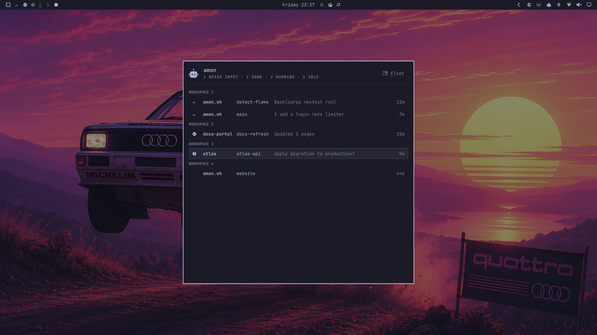

# amon

<p align="center">
  <picture>
    <source media="(prefers-color-scheme: dark)" srcset="docs/amon-logo-dark.svg">
    
  </picture>
</p>

amon lets you know when your agents are working, idle, or need your
attention. It runs them untouched in your own terminal. Any agent, one
keystroke away.

Built for [Omarchy Linux](https://omarchy.org).

```sh
curl -fsSL amon.sh/install | sh      # opens amon setup - or build from source, see below
```

## Agents as first-class citizens on your desktop

Omarchy is the perfect environment for agents: a workspace holds everything a
project needs - agent terminals, a browser, the logs - tiled or
side-scrolling, set up the way you want. amon adds the missing piece: it shows
you what your agents are doing, which one needs your attention, and lets you
jump straight to it.

Start agents in the terminal as usual. The bar shows each workspace's most
urgent agent state on that workspace's own indicator, and `Super+number` lands
on the agent that needs you rather than on whatever was focused there last -
blocked first, then finished-but-unseen, then working, never an agent at rest.

Agents you run in [herdr](https://github.com/herdrdev/herdr) or
[luvus](https://github.com/RizRiyz/luvus) count too. amon watches for their
sessions and puts their agents on the bar and in the panel beside the wrapped
ones, with the same states, and jumping to one lands on the right pane, not
just the right window. Wrap an agent, or host it in a runtime - either way it
is one keystroke away.

`Super+A` opens the agent panel from wherever you are, over whatever you are
doing: every agent, grouped by the workspace it is on, each row leading with the
project it is working in and the branch it is on, then what it is doing and how
long it has been at it. Pick one and Enter puts you in front of it.
`Super+W` closes the panel while it is open - amon rebinds Omarchy's
close-window key to ask the panel first, so the window underneath survives.

`Super+Alt+A` opens the start agent panel: the agents you started, one row per
agent and folder, most recent first: the agent, the project, the folder, and
when you last started it. Pick one and a new terminal opens there running that
agent again - bare, without the arguments it had. Agents you started on
another machine over SSH are on the list too and start there again. The list
is `~/.local/state/amon/started.toml`, which you can edit; it keeps the last
25 (ADR-0026).

Have a Work Louder Creator Micro 2 on the desk? Connect it (USB or
Bluetooth) and it becomes a hardware agent panel: six keys, one per agent in
the panel's order, each colored by its agent's state, the ring glowing when
anything needs you, tap a key to be at that agent. The encoder scrolls, the joystick moves window focus, and every
control is remappable - see Settings.

There is nothing to configure. `amon setup` makes it all work automatically -
agent hooks, aliases, the bar widget, the panel, the keybindings - and
`amon doctor` reports what is wired up and what is not.

```sh
amon claude          # wrap any agent - output passes through untouched
amon codex --resume
amon status          # what's blocked, working, or idle right now?
amon focus 3         # go to workspace 3, landing on the agent that needs you
amon setup           # agent hooks, aliases, the desktop integration
amon doctor          # integration, daemon, widget, audio, and alias health
```

```
$ amon status
3  amon.sh     main           4m  blocked   claude
1  scriptcast  record-fix    12s  working   codex
1  api         main           3m  idle      claude
```

The workspace, then the project the agent is working in and the branch it is
on, then how long it has been in that state, the state, and the kind of agent -
the same fields in the same order the panel uses. A worktree reports the
repository it was cut from, not its own directory. Agents outside a repository
show their directory instead, and the branch column disappears when no agent
can fill it.

## Screenshot



## How it works

`amon` runs an agent in a PTY and passes its output through unchanged, keeping
a copy for a headless *shadow terminal* it uses to detect whether the agent is
working, idle, or blocked waiting for you. It reports that to a per-user daemon
(started on demand) which keeps a live registry of every wrapped agent and
pushes events to subscribers over a unix socket.

Not every agent is wrapped. One with a terminal on neither side of it - a
background agent that another agent started, a cron job, a CI step - has no
window to switch to, so amon steps out of the way and runs it directly rather
than adding a row you cannot act on
([ADR-0016](./docs/adr/0016-a-terminal-is-what-makes-an-agent-worth-tracking.md)).

On Hyprland each agent also carries the window it is running in and that
window's workspace, so "which one is blocked" comes with "and it is over
there" - which is what the bar, the panel, and `amon focus` turn into
somewhere to go. Subscribers get two more facts the terminal itself reports:
whether the agent's view has focus, and whether it has had focus since the
agent last changed state, which is what tells an agent that finished unnoticed
from one you watched finish.

The agent cannot tell amon is there: amon answers no terminal queries, injects
nothing into its stream, and keeps the shadow terminal the same size as your
real one. (Amon does ask the terminal itself to report focus, and takes those
reports back out of the agent's input - [ADR-0007](./docs/adr/0007-wrapper-enables-terminal-focus-reporting.md)
covers what that costs and why.) If the daemon is missing, wedged, or killed,
the agent keeps running - observability never interrupts your session.

Inside a herdr or luvus session there is no wrapping at all: the daemon speaks
to the runtime's socket, takes the agent states it detects itself, and carries
them onto the bar with the window of the attached client. Agents are shown for
as long as a client is attached to their session, and `amon focus` asks the
runtime to bring the agent's pane forward once the window is up. An
`amon claude` typed in a herdr or luvus pane runs the agent bare, so there is
one detection authority per context
([ADR-0001](./docs/adr/0001-vendor-herdr-terminal-and-detect.md),
[ADR-0018](./docs/adr/0018-runtimes-live-behind-one-seam.md),
[the design](./docs/research/herdr-live-integration.md)).

## Remote agents over SSH

An agent running on another machine can be a first-class citizen of your
desktop. `amon setup ssh` aliases `ssh` to `amon ssh`, so every session you
open runs under amon - or type `amon ssh build-box` for one. A wrapped ssh
session has no row of its own and shows nothing; run an agent inside it, with
amon installed on the far end too, and the agent appears in your bar, your
panel, and `amon status`, with its own name, directory, branch, state, and
what it is doing. It sorts where its window sits, chimes when it blocks or
finishes while you are not looking at that window, and `Super+number` lands
on the ssh window it lives in. When it ends, the row goes with it. Hooks
report on the remote host exactly as they do locally. `amon remove ssh`
takes the alias out.

Nothing is required of the transport beyond an interactive session — plain
OpenSSH, Tailscale SSH, and jump-host chains all work, with no port
forwarding and no configuration. The remote wrapper sends one invisible
~20-byte probe when a session begins, and stays byte-silent unless an amon
on your side answers it; only then do events travel, as escape sequences
your wrapper strips back out before your terminal sees them
([ADR-0023](./docs/adr/0023-agent-events-ride-the-terminal-stream.md)).
The agent's lifetime is the session's: close the connection and the agent
ends, exactly like closing a local terminal window
([ADR-0024](./docs/adr/0024-a-remote-agents-lifetime-is-its-ssh-session.md)).
Two known limits: tmux on the remote end swallows the events unless its
`allow-passthrough` is on, and mosh drops them entirely — either way the
session simply behaves as it does today.

## Subscribing

The daemon speaks newline-delimited JSON over `$XDG_RUNTIME_DIR/amon/amond.sock`.
Any language can watch state changes live:

```sh
{ echo '{"id":"1","method":"hello","params":{"role":"subscriber","protocol":1,"version":"cli"}}'
  echo '{"id":"2","method":"subscribe"}'
  cat
} | socat - UNIX-CONNECT:$XDG_RUNTIME_DIR/amon/amond.sock
```

The wire format is documented in [docs/protocol.schema.json](./docs/protocol.schema.json),
generated from the Rust types and checked by a test.

## Building

Needs a Rust toolchain, plus **Zig 0.15.2** - the shadow terminal is Ghostty's
emulator, which builds from Zig source. With [mise](https://mise.jdx.dev) both
are pinned in `.mise.toml`:

```sh
mise install
just build
just test        # cargo-nextest; the vendored tests need a process per test
```

## Installing

One command, no root. One file is the whole install - the daemon and the
wrapper are subcommands of the same binary, so there is no service to enable
and nothing else to place:

```sh
curl -fsSL amon.sh/install | sh      # installs, then opens amon setup
amon doctor                          # what is wired up and what is not
```

The installer puts the latest release binary in `~/.local/bin` - on `PATH` in
stock Omarchy - and the license files in `~/.local/share/amon`. It verifies
the tarball against its published sha256 before installing, then opens the
setup screen right there in your terminal. Pin a version with
`AMON_VERSION=v0.1.0`, change the directory with `AMON_PREFIX`.

`amon setup` with no argument opens that screen again; `amon setup --all`
takes every agent it detects plus the desktop integration without one, and a
named target is always an agent (`amon setup claude`). Open a new shell
afterwards for the aliases.

Upgrading is running the installer again: it replaces the binary safely even
while agents are wrapped, and refreshes what setup installed (`amon setup
--upgrade`) without revisiting any choice. The agent panel tells you when a
newer release exists - a one-line footer with this same command - and the
daemon's daily check behind it can be turned off with `[updates] check =
false` (see Settings). Uninstalling is `amon remove --all`, then deleting
`~/.local/bin/amon` and `~/.local/share/amon`.

Building from source instead: `just install` does the same install from this
repository (see Building above), and `just uninstall` reverses it,
integrations first so nothing is left pointing at a binary that is gone.

### Setting up a Creator Micro 2

A Work Louder Creator Micro 2 needs three things, and `amon doctor` checks
each one:

1. **Firmware 0.6.0 or newer.** Older firmware has no agent keys at all and
   doctor says so. Update it in Work Louder's Input app; 0.6.2 has been the
   stable release since August 2026.
2. **Access to the device.** `/dev/hidraw*` and `/dev/uinput` are root-only
   on a stock system. `amon setup` shows the one udev rule that grants the
   logged-in seat access and installs it with your sudo if you say yes. A
   machine that has run the Input app usually has an equivalent rule
   already, and then this step never appears.
3. **The agent layer, and the board on it.** The six lit keys only report to
   amon on a layer whose keys are the firmware's vendor keycodes; on any
   other layer they type letters and light the way the app said. A fresh
   board has no such layer. `amon setup` offers to write one onto an empty
   layer, after saving the board's current keymap to
   `~/.local/share/amon/micro2/`; the Input app can add the same layer
   ("Add a new Codex layer"). Then tap the touch sensor at the board's
   bottom left until its LEDs show that layer - switching is physical, and
   amon cannot do it for you.

Connect the board over USB or Bluetooth and run `amon setup`. When all three
are in place, `amon doctor` reads:

```
devices:
  micro2       connected (the daemon lights it) /dev/hidraw5
  firmware     0.6.3-rc.10
  layer        agents on layer 1 of 3, active
```

Anything short of that, doctor names: the firmware floor, the missing rule,
a layer written but not active, or a board whose six layers are all in use.
Dictation on the mic key needs [voxtype](https://github.com/voxtype/voxtype)
installed; without it the key does nothing.

The same install command works on an Apple Silicon Mac, for the remote end
of an SSH session: the wrapper, the daemon, and the CLI — `amon status`,
`amon setup` for agent hooks and aliases (written to `~/.zshrc` there),
`amon doctor` — with no desktop surface, since the desktop is Omarchy's
([ADR-0025](./docs/adr/0025-macos-is-a-headless-target.md)). A remote Mac
agent's chimes and indicators happen on the Omarchy desktop watching it.
Intel Macs build from source.

## Command line reference

**`amon setup [target] [--all] [--no-alias] [--upgrade] [--duck | --no-duck]`**

Set up integrations. Without arguments, an interactive screen; with a target,
one agent (`amon setup claude`), or `ssh`, which only aliases ssh to `amon
ssh` so agents on the machines you reach show up here. `--all` takes every detected agent plus the
desktop integration without a screen. `--no-alias` skips aliasing the agent's
name, on the non-interactive forms only; the screen always aliases.
`--upgrade` refreshes everything already set up after a binary upgrade -
installs nothing new and revisits no choices; the installer runs it for you.
Ducking - music dips while a notification plays - is included by default
where WirePlumber runs (one drop-in file amon owns; deleting it restores
stock audio); `--no-duck` opts out, and either flag alone installs or
removes just that piece.

**`amon status [--json]`**

What every connected agent is doing, most urgent first: workspace, project,
branch, age, state, agent kind - the panel's field order, with the workspace
leading a line here where the panel makes it a heading. A column no agent can
fill is not printed at all. `--json` prints the entries machine-readable instead
of as a table.

**`amon start [--json]`, `amon start <agent> --dir <folder> [--host <host>]`**

The agents you started, most recent first - what the start agent panel
lists. With an agent and a folder, opens a new terminal there running that
agent again; with `--host`, one from the list that ran on another machine,
reached again over the same SSH arguments.

**`amon focus <workspace>`**

Go to a workspace by number, landing on the agent that needs your attention
rather than on whatever was focused there last. A plain workspace switch when
no agent wants anything. With `--cycle`, run again while one of that
workspace's agents is focused, it goes to the next agent there instead, in
the panel's order - what the Micro 2's workspace keys do; Super+N does not.

**`amon doctor`**

Integration, daemon, widget, audio, and alias health in one report.

**`amon --help | --version`**

Help for amon or any subcommand (`amon setup --help`), and the version. Flags
before an agent's name are amon's own; unknown ones are an error rather than
something an agent might see.

**`amon <agent> [args...]`**

Run an agent under amon. Any first word that is not a subcommand names an
agent, and every argument after it is passed to the agent verbatim, flags
included, nothing interpreted.

**`amon remove [target] [--all]`**

Remove integrations: one target, or everything after one confirmation.
`--all` skips the confirmation, for scripts.

**`amon daemon`**

Run the daemon in the foreground. Rarely needed: any amon command starts it
on demand.

**`amon hook report-agent | report-agent-session`**

Relays an installed hook's report, the agent's state or which session it is
in, to its wrapper. Used by the hook scripts `amon setup` installs, not by
hand.

## Settings

Everything configurable lives in one file, `~/.config/amon/config.toml`.
`amon setup` writes it once, fully commented and fully commented-out, and
never touches it again. Every setting is optional; the value shown is the
default. The daemon watches the file, so changes apply live under a running
bar, nothing restarts. A file that fails to parse keeps the last good
configuration (`amon doctor` reports it), and a missing file simply means
the defaults.

The glyph defaults are Nerd Font characters; they render wherever a Nerd
Font is installed, which on Omarchy is everywhere.

**`[bar]`**

- `frame_ms = 200` - how long one spinner frame is shown, in milliseconds.
  Four frames at 200ms is one turn every 800ms.
- `state_beats = 5` - the focused workspace takes turns between its agent's
  state and the marker that says you are here; beats spent on the state. A
  beat is half a spinner turn, so the rhythm follows the spinner's speed.
- `marker_beats = 3` - beats spent on the focus marker in that same
  turn-taking.

**`[bar.glyphs]`**

- `working = ["⠒", "⠰", "⠤", "⠆"]` - the animation frames for a working
  agent, in order, any length; one frame is a static glyph. Plain characters,
  here and below: a glyph setting chooses which character, never how it is
  drawn.
- `blocked = "󰋗"` - the glyph for an agent that needs input.
- `done = "󰗠"` - the glyph for an agent that finished while you were not
  looking. An agent at rest has no glyph; its workspace keeps the number,
  underlined.
- `focused = "󱓻"` - the marker for the workspace you are on.

**`[sound]`**

- `enabled = true` - a short sound when an agent starts waiting for you, and
  when one finishes unwatched. Nothing plays for an agent you are looking
  at. Set to false to silence both.
- `done = ".../finished.mp3"` - your own sound for the finished-unwatched
  case, instead of the bundled one. A relative path resolves from the config
  file's own directory.
- `blocked = ".../attention.mp3"` - your own sound for the needs-input case,
  same rules.

Music and other audio dip to a quarter volume while these sounds play if
ducking is set up (`amon setup --duck`, on by default in setup). It is one
WirePlumber drop-in owned by amon; `amon setup --no-duck` removes it and
restores stock audio completely. The buses it routes audio through are
stereo - on a surround or bitstream-passthrough setup, skip ducking.

**`[updates]`**

- `check = true` - whether the daemon may look for newer releases: one
  request against the GitHub release page's redirect, at most daily, with
  nothing about your machine in it. When a newer release exists, the agent
  panel shows a one-line footer with the command that upgrades; nothing
  downloads or installs itself. Set to false and it never checks.

**`[devices.micro2]`**

A Work Louder Creator Micro 2 lights up by itself when connected - these
only tune it. On a machine that has never had Work Louder udev rules, one
root step grants access; `amon setup` offers it.

- `enabled = true` - set false to leave the device alone entirely.
- `brightness = 1.0` - keys and ring alike, 0.0-1.0.
- `ring = true` - the ambient ring shows the fleet's most urgent state:
  solid orange when anything needs input, snaking blue while anything
  works, breathing green when something finished unseen.
- `agent_keys = "agents"` - what the six lit keys stand for. `"agents"`: key
  N is the panel's Nth agent and a tap focuses exactly that agent.
  `"workspaces"`: key N is workspace N, lit by its most urgent agent, and a
  tap does what `Super+N` does - lands on the agent there that most wants
  you, or on the workspace when none does. Tap it again and it moves on to
  the next agent on that workspace, left to right.

**`[devices.micro2.colors]`**

- `blocked = "#FF6D00"`, `working = "#304FFE"`, `done = "#00FF4C"`,
  `idle = "#FFFFFF"` - per-state key colors.

**`[devices.micro2.keys]`**

The seven macro keys, any action. Controls: `macro_1`..`macro_7` in
reading order - `macro_1`-`macro_4` across the upper row, `macro_5`-
`macro_7` across the lower. Actions: `none`, `panel`, `start`,
`workspace:N`, `key:<chord>` (e.g. `key:super+shift+f`), `exec:<command>`.
The defaults: the agent panel, the start agent panel (as Super+Alt+A; press
again to close), Up, Escape on the upper row; dictation
(`voxtype record toggle`), Down, Enter on the lower. Everything else is
fixed: agent key N lights and focuses the panel's Nth agent (grouped by
workspace, left to right as their windows sit; workspace N instead with
`agent_keys = "workspaces"`), the encoder scrolls
(and walks the agent panel while it is open, its click selecting), the
joystick moves window focus like Super+arrows.

A complete example, in `~/.config/amon/config.toml` - a file from before
this section existed has no `[devices]` block, so add it by hand; saved
changes apply within a second:

```toml
[devices.micro2]
brightness = 0.7

[devices.micro2.keys]
macro_2 = "exec:obsidian"          # second key, upper row: open Obsidian
macro_4 = "key:super+shift+f"      # fourth key, upper row: send a chord
macro_7 = "workspace:5"            # last key, lower row: jump to workspace 5

[devices.micro2.dictation]
hold_ms = 300                      # a press this long counts as holding
auto_submit = false                # a hold's end no longer presses Enter

[devices.micro2.colors]
working = "#7D74F0"                # any state, any color
```

**`[devices.micro2.dictation]`**

The dictate key reads two ways, and recording starts on the press either
way: a tap toggles (tap again to stop), a hold is push-to-talk. `hold_ms =
250` is how long a press counts as holding; `auto_submit = true` presses
Enter for you when a hold ends and the text has landed. Taps never do.

## Credits

- [Omarchy](https://omarchy.org) - the desktop this is built for; the bar
  widget is a four-line fork of its own workspaces widget, and the panel is
  built from its shell's components.
- [herdr](https://github.com/herdrdev/herdr) by Ogulcan Celik
  (Apache-2.0) - agent state detection and its manifests, the terminal state
  machine, and the per-agent hook installer are all derived from it, and
  detection manifests refresh from herdr's public catalog. An excellent agent
  runtime worth using in its own right - and amon shows the agents living in
  it.
- [luvus](https://github.com/RizRiyz/luvus) by Riz (Apache-2.0) - nothing is
  vendored from it, but amon speaks its API and shows the agents living in
  it. Another agent runtime worth a look.
- [libghostty-vt](https://github.com/ghostty-org/ghostty) (MIT) - terminal
  emulation, Ghostty's VT library.

Vendored code is never hand-edited: `just revendor` re-derives it from a pinned
herdr commit. See [NOTICE](./NOTICE) and [ADR-0005](./docs/adr/0005-vendored-code-is-never-hand-edited.md).

## Design

[CONTEXT.md](./CONTEXT.md) defines the project's language.
[docs/adr/](./docs/adr/) records the decisions that are hard to reverse - what
is vendored and why, the daemon's lifecycle, and where hooks connect.

## License

Apache-2.0. See [LICENSE](./LICENSE) and [NOTICE](./NOTICE).
